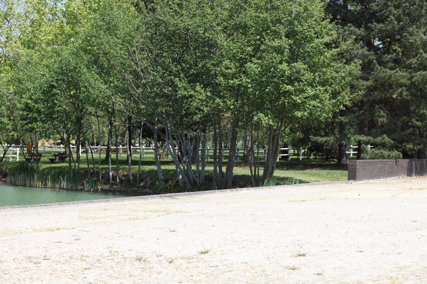
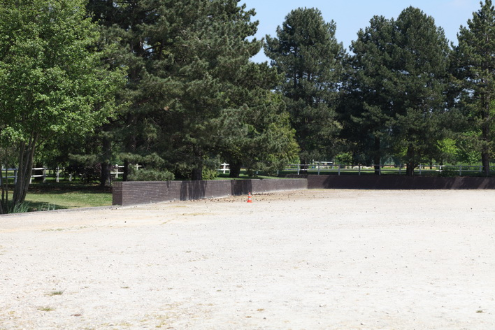
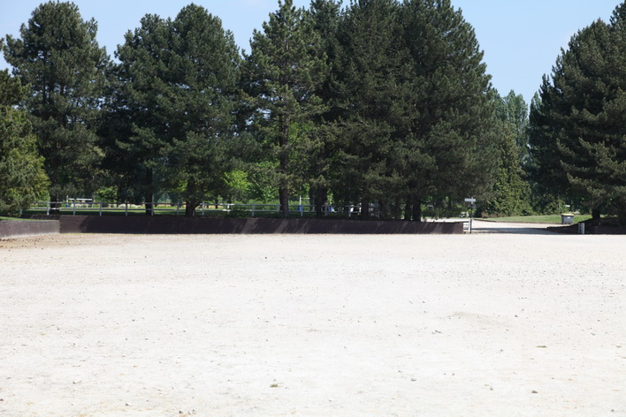
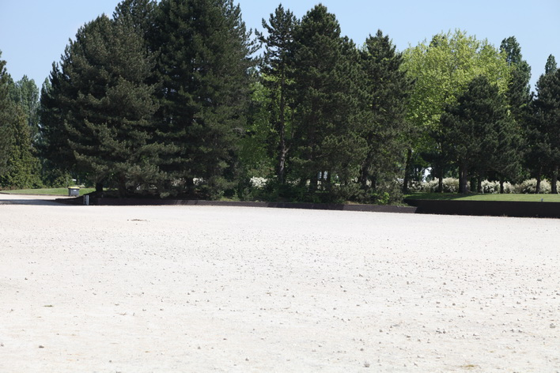
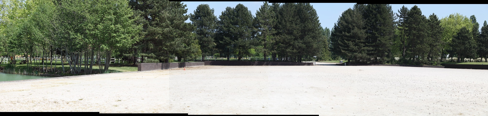
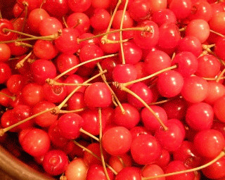
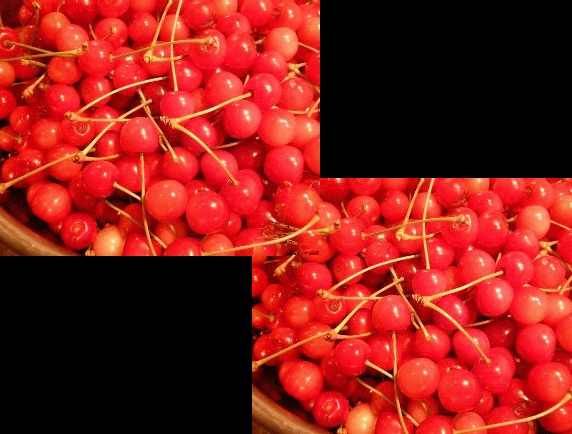

# Seamless Image Stitching

Seamless image stitching by graph cut method, partially adapted from paper [Graphcut Textures: Image and Video Synthesis Using Graph Cut](http://www.cc.gatech.edu/cpl/projects/graphcuttextures/gc-final-lowres.pdf). 

# Dependencies

-   `cmake`
-   `opencv` 3.0
-   [`maxflow`](http://pub.ist.ac.at/~vnk/software.html)

# Compilation

    mkdir build
    cd build
    cmake ..
    make

# Execution

    ./main img1 img2 ...

>   Input images are not necessarily in good order in case of panorama.

# Example

## Panorama

### Input Photos

### Output Photo

## Image Synthese

### Input Photo

### Output Photo

